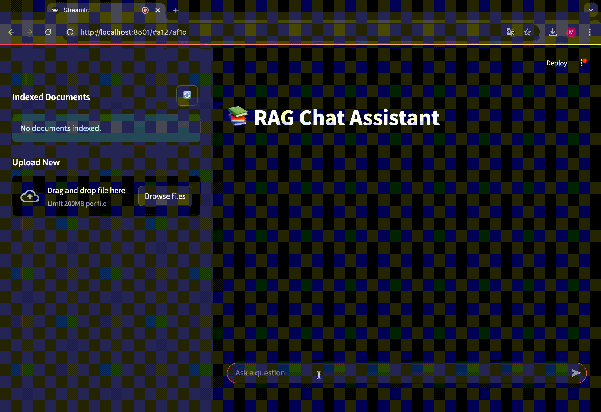

# Azure RAG Chat Assistant with Terraform Deployment

## Overview
This project demonstrates a Retrieval-Augmented Generation (RAG) pipeline built entirely on Microsoft Azure and deployed using Terraform. It allows users to upload PDF documents and interactively ask questions about their content through a chat interface, leveraging Azure AI Search for retrieval and Azure OpenAI for generation.

## Demo

## Features

*   **Automated PDF Ingestion:** Azure Function processes PDFs uploaded to Azure Blob Storage.
*   **Vector Embedding & Indexing:** Text is chunked, embedded (using `text-embedding-ada-002`), and indexed in Azure AI Search.
*   **Retrieval-Augmented Generation:** User queries retrieve relevant document chunks via vector search to provide context to the LLM.
*   **Interactive Chat UI:** Streamlit application provides a user-friendly interface for document upload and Q&A.
*   **Infrastructure as Code:** All necessary Azure resources are defined and deployed using Terraform.
*   **AI-Powered Responses:** Leverages Azure OpenAI GPT-4o for generating answers based on retrieved context.

## Architecture
The system consists of two main pipelines:

1.  **Ingestion Pipeline:** Triggered by PDF uploads to Blob Storage, an Azure Function chunks, embeds, and indexes the content into Azure AI Search.
2.  **Query Pipeline:** The Streamlit UI takes user input, generates an embedding, queries AI Search for relevant context, augments the prompt, and calls Azure OpenAI to generate the final response.

Architecture Diagram:

## Technology Stack

*   **Cloud Platform:** Microsoft Azure
*   **Infrastructure as Code:** Terraform
*   **Compute:** Azure Functions (Python Runtime)
*   **Storage:** Azure Blob Storage
*   **Search/Vector DB:** Azure AI Search
*   **AI/Embeddings:** Azure OpenAI Service (GPT-4o, text-embedding-ada-002) 
*   **Web Framework:** Streamlit
*   **Language:** Python

## Setup & Installation

### Prerequisites

*   Azure Subscription (with necessary permissions)
*   Azure CLI
*   Terraform (v1.x.x or later)
*   Python (3.9 or later recommended)
*   Git
*   CURL

### Configuration

1.  Clone the repository: `git clone https://github.com/jmac83/rag.git`
2.  Navigate to the Terraform directory: `cd rag/infra` 
3.  Configure necessary Azure credentials for Terraform (e.g., via Azure CLI login `az login`, Service Principal).
4.  Create a `terraform.tfvars` file and add variable subscription_id=<your_subscription_id> 
5.  terraform init
6.  terraform apply
7.  test deployment: open chat_web_ui_url given in the outputs

## Running web ui locally

1.  Assuming deployment has been done as descriped in previous step: `cd rag/chat-ui`
2.  Create python virutal environment: `python3.9 -m venv .venv && source .venv/bin/activate`
3.  Install Python dependencies: `pip install -r requirements.txt`
4.  Go to infra directory and set configuration from terraform state: `cd ../infra && source ./set_tf_envs.sh`
5.  Navigate back the Streamlit app directory: `cd ../streamlit_app` 
6.  Run the Streamlit app: `streamlit run app.py` 
7.  Open the provided local URL in your browser.
8.  Use the interface to upload PDF documents.
9.  Ask questions related to the content of the uploaded documents.

## Future Improvements

While the current implementation provides a functional RAG demonstration, potential future enhancements could include:

*   **Agentic RAG / LLM Tool Use:** Implement function calling or tool use capabilities, allowing the LLM to potentially perform actions beyond simple retrieval (e.g., directly querying Azure Search with generated filters, calling other APIs) for more dynamic interactions.
*   **Enhanced Security with Azure Key Vault:** Integrate Azure Key Vault to securely store and manage all secrets (API keys, connection strings) instead of relying solely on environment variables or Terraform outputs accessed via scripts.
*   **Network Security with Private Endpoints:** Configure Private Endpoints for Azure services (Blob Storage, Functions, AI Search, OpenAI) to ensure communication occurs over the Azure private network backbonex
*   **User Authentication & Personalization:** Implement user accounts (e.g., using Azure AD B2C or another identity provider) to enable multi-user support and secure access.
*   **Conversation History:** Persist chat history per user sessionx to allow for contextually aware follow-up questions within a conversation.
*   **Shared Code Library:** Create a common Python library containing shared logic (e.g., data models, Azure service interaction clients) used by both the Azure Function and the Streamlit UI to reduce code duplication and improve maintainability.
*   **UI Code Refactoring:** Refactor the Streamlit application code 

## License

Distributed under the Apache License. See `LICENSE` file for more information.